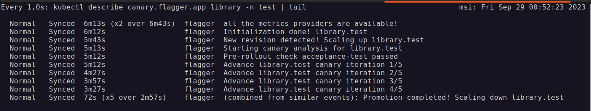

# Blue/Green deployment with Istio

## Setup the environment

[Blue/Green deployments with Flagger and Kubernetes](https://fluxcd.io/flagger/tutorials/kubernetes-blue-green/)

### Generate Docker images in DockerHub

Prior to this, need modify the application properties in all versions to use the same port since blue/green deployment forward all traffic to the new application version.

``` bash
mvn spring-boot:build-image -Dspring-boot.build-image.imageName=manloralm/mca-4.3-p2:v<version>

docker push manloralm/mca-4.3-p2:v<version>
```

Need to deploy first the database to allow pass the integration tests.

``` bash
docker run -d \
--name mysql \
-e MYSQL_DATABASE=test \
-e MYSQL_ROOT_PASSWORD=pass \
-p 3306:3306 \
mysql:8.0.23
```

### Setup MiniKube cluster with Istio 1.19 and Kubernetes Metrics Server

``` bash
minikube start --memory 12288 --cpus 4 \
--addons enable ingress \
--addons enable istio-provisioner \
--addons enable istio \
--addons enable metrics-server
```

### Install Istio 1.19 and metrics server

``` bash
istioctl install --set profile=default

kubectl apply -f https://raw.githubusercontent.com/istio/istio/release-1.19/samples/addons/prometheus.yaml

```

### Add Flagger and Grafana to k8s cluster

``` bash
helm upgrade -i flagger flagger/flagger \
--namespace=istio-system \
--set crd.create=false \
--set meshProvider=istio \
--set metricsServer=http://prometheus:9090

helm upgrade -i flagger-grafana flagger/grafana \
--namespace=istio-system \
--set url=http://prometheus.istio-system:9090 \
--set user=admin \
--set password=change-me

kubectl -n istio-system port-forward svc/flagger-grafana 3000:80

```

Navigate to <http://localhost:3000> - admin/change-me

## Setup the application

### Create the namespace test and enable istio injection

``` bash
kubectl create ns test

kubectl label namespace test istio-injection=enabled

```

### Deploy database and application

``` bash
kubectl apply -f k8s/mysql.yaml

kubectl apply -f k8s/library.yaml
```

### Deploy canary resource and gateway

``` bash
kubectl apply -f k8s/gateway.yaml

kubectl apply -f k8s/library-canary.yaml
```

### Deploy the load testing service to generate traffic during the analysis

``` bash
kubectl apply -k github.com/weaveworks/flagger//kustomize/tester
```

## Testing

### Deploy each version of the application

``` bash
kubectl -n test set image deployment/library library=manloralm/mca-4.3-p2:v2

kubectl -n test set image deployment/library library=manloralm/mca-4.3-p2:v3

kubectl -n test set image deployment/library library=manloralm/mca-4.3-p2:v4
```

### Watch the canary progress

``` bash
watch -n 1 'kubectl describe canary.flagger.app library -n test | tail'
```

### Output result


